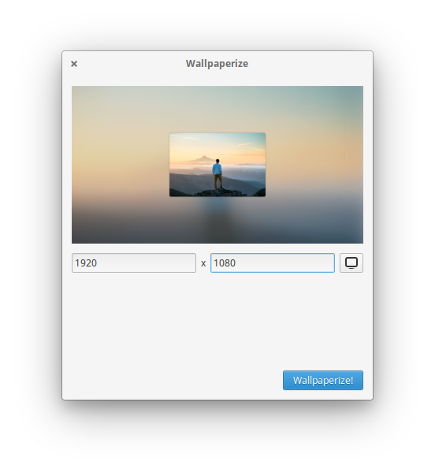

# Wallpaperize

Turn your oddly sized wallpapers into a piece of beauty. Simply right click on your picture's file, and select "Wallpaperize" from the drop down menu. 

## Instalation 

You can find this app on AppCenter, on elementary OS

## Build the App

Run `meson build` to configure the build environment and then change to the build directory and run `ninja` to build

    meson build
    cd build
    mesonconf -Dprefix=/usr
    ninja

To install, use `ninja install`, then execute with `com.github.philip-scott.wallpaperize`

    sudo ninja install
    com.github.philip-scott.wallpaperize

### Credits
Original app: http://backgroundifier.archagon.net
Request from: Mario Daniel Ruiz
