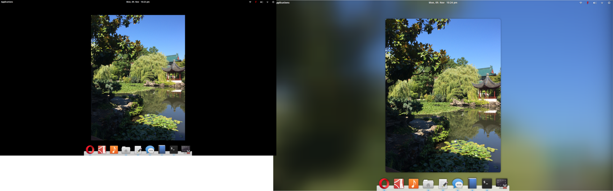

# Wallpaperize

Turn your oddly sized wallpapers into a piece of beauty. On elementary os, simply right click on your picture's file, and select "Wallpaperize" from the drop down menu. 

## Instalation 
1. cd to this directory
2. Execute the make.sh file

### Credits
Original app: http://backgroundifier.archagon.net
Request from: Mario Daniel Ruiz
